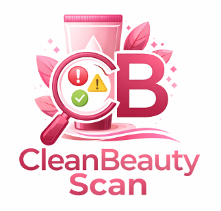

<!DOCTYPE html>
<html lang="es">
    

    

        &times;
        <h2 id="tituloModal"></h2>
        

    

<head>
    <meta charset="UTF-8">
    <title>CleanBeauty Scan</title>

    <link href="https://fonts.googleapis.com/css2?family=Poppins:wght@300;400;600&display=swap" rel="stylesheet">

    <link rel="stylesheet" href="style.css">
</head>
<body>
    
    
    <!-- BOTÓN DE AYUDA -->
    
❔

    <!-- MODAL DE SOPORTE -->
    

    

        &times;
        <h2>Soporte</h2>

        <input type="text" id="nombre" placeholder="Tu nombre">  
        <textarea id="mensaje" placeholder="Describe el problema..."></textarea>  

        <button onclick="enviarCorreo()">Enviar</button>
    

    

    <!-- Menu interactivo -->
    <nav class="navbar">
    <ul>
        <li onclick="abrirInfo('nosotros')">Quiénes somos</li>
        <li><a href="ingredientes.html">Ingredientes</a></li>
        <li onclick="abrirInfo('contacto')">Contacto</li>
        <li onclick="abrirInfo('soporteInfo')">Soporte</li>
    </ul>
    </nav>
    <!-- Banner de fotos -->
    

    
    

    

    

    <!-- Logo -->
    
    <h1>🌸 CleanBeauty Scan 🌸</h1>

    <textarea id="ingredientes" placeholder="Ej: Parabenos, Alcohol Denat, Glycerin"></textarea>

      

    <button onclick="analizar()">Analizar</button>
    <button onclick="reiniciar()">Reiniciar</button>

    <h2>Resultado:</h2>
    <ul id="resultado"></ul>

    <!--MODAL DE RESULTADOS -->

    

        &times;
        <h2>Resultados del análisis</h2>
        <ul id="detalle"></ul>
    

    <h3 id="alerta"></h3>

    
<footer class="footer">
    
© 2026 CleanBeauty Scan - Desarrollado por Rosa Isela Barajas Mercado. Todos los derechos reservados.

</footer>
</body>
</html>

<!--

# 🌸 CleanBeauty Scan

  

**CleanBeauty Scan** es una aplicación web diseñada para analizar ingredientes en productos cosméticos y de cuidado personal de forma rápida y sencilla.

El sistema permite al usuario ingresar una lista de ingredientes y, mediante técnicas inspiradas en el análisis de compiladores (léxico, sintáctico y semántico), identifica y clasifica cada componente como:

- 🔴 **Peligroso**
- 🟠 **Irritante**
- 🟢 **Seguro**

Además, la herramienta detecta errores en la entrada, reconoce diferentes formas de escritura (mayúsculas, acentos, inglés/español) y muestra los resultados en una interfaz amigable mediante alertas y ventanas emergentes.

Incluye también:
- 📚 Información sobre ingredientes
- 🎞️ Banner visual interactivo
- 💬 Sistema de soporte para enviar reportes al administrador

---

## 🚀 Objetivo

Brindar a los usuarios una forma fácil y accesible de comprender la composición de los productos que utilizan diariamente, ayudándolos a tomar decisiones más informadas sobre su cuidado personal.

---

## 🛠️ Tecnologías utilizadas

- HTML
- CSS
- JavaScript
- EmailJS

---

## 💡 Nota

Este proyecto aplica conceptos de compiladores en un contexto real, demostrando cómo la tecnología puede utilizarse para mejorar el bienestar y la conciencia del consumidor.

---

✨ *Desarrollado con enfoque en la salud, la tecnología y la simplicidad.*

-->

